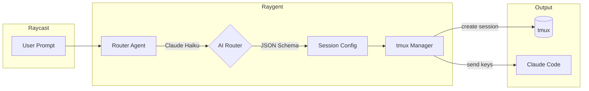

# Raygent

Raycast → Claude Code via tmux. Launch headless Claude Code sessions with AI-powered workspace routing.

## Architecture



## Flow

1. **Raycast** triggers with user prompt
2. **Router Agent** calls Claude Haiku with `--json-schema` for structured output
3. **AI** determines session name + workspace from `config.json` keywords
4. **tmux** creates detached session in workspace directory
5. **Claude Code** launches with original prompt (headless)

## Setup

```bash
# Install
cp config.example.json config.json
# Edit config.json with your paths and keywords

# Add to Raycast
# Import raycast-raygent.sh as Script Command
```

## Configuration

`config.json` (gitignored):

```json
{
  "default": "work",
  "workspaces": {
    "work": {
      "path": "/path/to/work",
      "keywords": ["work", "project"]
    },
    "personal": {
      "path": "/path/to/personal",
      "keywords": ["personal", "dotfiles"]
    }
  }
}
```

## Usage

### Via Raycast
Invoke Raygent script command with your prompt.

### CLI
```bash
bun ~/dotfiles/scripts/raygent/raygent.ts "your prompt here"
```

### Test Router
```bash
bun ~/dotfiles/scripts/raygent/lib/router-agent.ts "your prompt"
```

### Attach to Session
```bash
tmux attach -t <session-name>
```

## Files

| File | Purpose |
|------|---------|
| `raygent.ts` | Main orchestrator |
| `lib/router-agent.ts` | AI routing via Claude Haiku |
| `lib/tmux.ts` | tmux session management |
| `raycast-raygent.sh` | Raycast script command |
| `config.json` | Workspace config (gitignored) |

## Dependencies

- [Bun](https://bun.sh) runtime
- [Claude CLI](https://github.com/anthropics/claude-code) (`~/.local/bin/claude`)
- tmux
