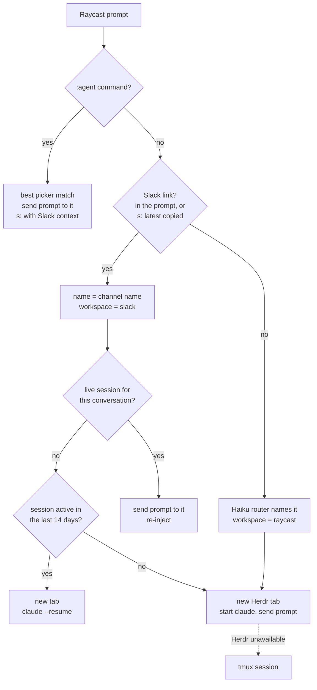

# Raygent

Raycast → Claude Code. Type (or dictate) a prompt in Raycast and Raygent starts a Claude Code session for it in Herdr or tmux, in the right directory, with a sensible name. Prompts about a Slack conversation are kept in one session per conversation.

```text
<mod> <:agent> <prompt>      both optional; see Usage
s can you look at xyz        new session bound to the Slack link you copied last
s :fe-ai can you look at xyz send to agent fe-ai, with that Slack link as context
```

## How a launch is routed


```mermaid
flowchart TD
    P[Raycast prompt] --> C{:agent command?}
    C -->|yes| A[best picker match<br/>send prompt to it<br/>s: with Slack context]
    C -->|no| S{Slack link?<br/>in the prompt, or<br/>s: latest copied}
    S -->|yes| L[name = channel name<br/>workspace = slack]
    S -->|no| H[Haiku router names it<br/>workspace = raycast]
    L --> M{live session for<br/>this conversation?}
    M -->|yes| R[send prompt to it<br/>re-inject]
    M -->|no| RS{session active in<br/>the last 14 days?}
    RS -->|yes| RE[new tab<br/>claude --resume]
    RS -->|no| N[new Herdr tab<br/>start claude, send prompt]
    H --> N
    N -.->|Herdr unavailable| T[tmux session]
```

1. **Commands**: a leading `:<agent>` sends the prompt to an existing agent instead (see [Commands](#commands)).
2. **Slack link**: taken from the prompt, or with the `s` mod from the clipboard: the Slack link copied last (see [Slack conversations](#slack-conversations)). Without `s` the clipboard is never read.
3. **Name and directory**: an `exactKeywords` match wins; otherwise Claude Haiku picks a short name and a workspace from `config.json`. A Slack launch is named after the channel instead. `launch.fixedCwd` pins the directory and skips workspace routing.
4. **Launch**: with `launch.mux: "herdr"`, a named Herdr agent in its own tab; otherwise (or if Herdr fails) a tmux session.
5. **Feedback**: a macOS notification says where the prompt went, or why the launch failed.

## Setup (per machine)

```bash
cd ~/dotfiles/scripts/raygent
cp config.example.json config.json   # then edit paths, keywords and the optional blocks below
```

1. **Raycast**: import `raycast-raygent.sh` as a Script Command and give it a hotkey.
2. **Herdr (optional)**: install [Herdr](https://herdr.dev) 0.9+ and set `launch.mux` to `"herdr"`. Without it Raygent uses tmux.
3. **Slack names (optional)**: add a `slack.workspaces` entry per workspace. Without `authCommand`, Slack sessions still work and are named `slack-{channelid}`.
4. **clip-watch (optional)**: `clip-watch/install-clip-watch.sh` so a copied Slack link is still found after something else (e.g. dictation) replaces the clipboard.
5. **Check it**: `bun ~/dotfiles/scripts/raygent/raygent.ts "say hello"` should open a session; `tail /tmp/raygent.log` shows what a Raycast launch did.

`config.json` is gitignored: everything machine- or organisation-specific lives there, never in this repo.

## Configuration

```json
{
  "default": "work",
  "workspaces": {
    "work": { "path": "$WORK_DIR", "keywords": ["work", "project"] },
    "review": {
      "path": "$WORK_DIR/repos",
      "keywords": ["review", "pr"],
      "exactKeywords": ["review-pr"],
      "tmuxSession": "review"
    }
  },
  "launch": { "mux": "herdr", "fixedCwd": "$WORK_DIR", "focusOnLaunch": false },
  "slack": {
    "workspaces": {
      "acme.slack.com": {
        "mcpServer": "slack-acme",
        "teamId": "T0123ABCD",
        "authCommand": "cat ~/.config/raygent/acme-slack-headers.json"
      }
    }
  }
}
```

### Workspaces

| Option          | Type     | Description                                                |
| --------------- | -------- | ---------------------------------------------------------- |
| `default`       | string   | Workspace used when the router fails or nothing matches    |
| `path`          | string   | Working directory for the session                          |
| `keywords`      | string[] | Hints the Haiku router matches the prompt against          |
| `exactKeywords` | string[] | Substring match on the prompt; skips the router            |
| `tmuxSession`   | string   | tmux only: fixed session name, new panes are added to it   |

### Launch (Raycast prompts only)

| Option                 | Description                                                                   |
| ---------------------- | ----------------------------------------------------------------------------- |
| `launch.mux`           | `herdr` or `tmux` (default)                                                   |
| `launch.fixedCwd`      | Always start here and skip workspace routing. Omit to keep routing            |
| `launch.focusOnLaunch` | Focus the agent and bring Ghostty forward (default: notification only)        |

Scheduled runs ignore the `launch` block and keep their own routing.

### Slack workspaces

Keyed by workspace host (`acme.slack.com`).

| Option        | Description                                                                                       |
| ------------- | ------------------------------------------------------------------------------------------------- |
| `mcpServer`   | Slack MCP server the session is told to read the conversation with                                |
| `teamId`      | Matches `app.slack.com/client/T…` and `slack://` links, which carry no host                        |
| `authCommand` | Optional shell command printing a JSON object of HTTP headers for Slack Web API calls, e.g. `{"Authorization": "Bearer …"}`. Used only to look up the conversation name |

### Path expansion

`path`, `launch.fixedCwd` support `~`, `$VAR` and `${VAR}` so configs stay portable. Variables resolve from the process environment at launch; an undefined variable fails loudly rather than starting a session in the wrong directory. The Raycast command runs Raygent through `zsh`, so variables exported in `~/.zshenv` are available; other callers (e.g. launchd) must export them first.

## Behaviour

### Herdr launches

Each Raycast prompt starts Claude as a **named Herdr agent** in its own tab, in one of two workspaces (created on first use):

| Workspace | Used for                                  | Tab / agent name               |
| --------- | ----------------------------------------- | ------------------------------ |
| `slack`   | Prompts with Slack context                | Channel name, or `slack-{id}`  |
| `raycast` | Everything else                           | Name chosen by the Haiku router |

The agent name is also the Claude session name (`claude -n`), and the prompt is submitted with `herdr agent prompt`. Names are made unique among live agents (`-2`, `-3`, …).

### Slack conversations

A launch is bound to a Slack conversation when:

- the prompt contains a Slack message link, or
- the prompt starts with the `s` mod: the most recently copied Slack link is used. A link on the current clipboard wins; otherwise the newest link [clip-watch](#clip-watch) recorded, so later copies (e.g. dictation) don't hide it. Without clip-watch only the current clipboard is checked. There is no age limit: `s` means "the link I copied last". If no Slack link was copied, nothing launches and the prompt is copied to the clipboard.

Then:

- **One session per conversation.** The key is workspace host + channel id, so any message link from the same channel reaches the same session.
- **Re-inject.** If a live agent is bound to the key (pane token `slack_key`), the prompt is sent to it instead of starting a new session. If that agent is waiting on a permission prompt, Raygent waits up to 10 minutes and then delivers; on timeout the prompt is saved under `pending/` in the state directory.
- **Resume.** If no tab is open but the conversation's last session was active (transcript written) in the last 14 days, it is resumed in a new tab (`claude --resume`, in its original directory) and the prompt is sent. Close Slack tabs whenever you like; the next prompt for that conversation brings the session back.
- **`:new`** starts a new session for the conversation even if one is open or resumable; an open tab stays, unbound.
- **Name.** Channel name for channels, `dm-{name}` for direct messages, `gdm-{names}` for group DMs. Looked up with `authCommand`, cached for a week. Any failure falls back to `slack-{channelid}`; routing is unaffected.
- **Context.** The prompt is prefixed with the link and the Slack MCP server to read it with.
- Scheduled runs never read the clipboard.

### Mods

Single-letter tokens at the very start of the prompt, before any `:command`. Only the exact lowercase letter counts: `S fix it`, `s3 bucket` and `fix s it` are ordinary prompts.

| Mod | Effect                                                                                                  |
| --- | ------------------------------------------------------------------------------------------------------- |
| `s` | [s]lack: bind to the Slack link copied last (see [Slack conversations](#slack-conversations)). With `:<agent>`, the prompt is sent with that link's Slack context |

### Commands

Leading `:word` tokens after any mod, in any order, single words (use hyphens):

| Command   | Effect                                                                                          |
| --------- | ----------------------------------------------------------------------------------------------- |
| `:new`    | Slack prompts: start a new session instead of re-injecting or resuming                          |
| `:<agent>`| Send the prompt to the existing agent the Herdr agent picker (⌘P) ranks first for `<agent>`: same rows (pane, tab, workspace, session title), same recency order, same fuzzy match. `:slak fix the copy` goes to the best match for "slak" |

Without `s`, `:<agent>` sends the prompt exactly as typed: the clipboard is not read and no Slack context is added (a link you type stays in the text). With `s :<agent>` the Slack context (copied link, or one typed in the prompt) is prepended; the agent is not bound to the conversation. If nothing matches, nothing launches: a notification says so and **your prompt is copied to the clipboard** so you can retry without retyping. Matching uses `herdr-agent-picker --match <query>`.

### clip-watch

macOS keeps a single clipboard item and has no change event. `clip-watch/clip-watch.swift` is a small login agent that polls the pasteboard's change counter twice a second (an in-process integer read; no measurable CPU) and reads the clipboard only when it changes. If the new content is a Slack conversation link, it records it. **Nothing else is ever stored.**

```bash
scripts/raygent/clip-watch/install-clip-watch.sh              # build + run as a login LaunchAgent
scripts/raygent/clip-watch/install-clip-watch.sh --uninstall  # stop and remove
```

- Keeps the last 5 links, drops any older than 10 minutes on each write.
- Re-run the installer after changing the Swift source.
- Optional: without it Raygent checks only the current clipboard.

### Scheduled runs

Prompts containing agent-scheduler's `<agent-scheduler task-id="…" />` marker are scheduled runs. They launch claude with a pre-provisioned `--session-id` and are recorded for agent-scheduler's stale-session reaper: tmux sessions get `@sched_task` / `@sched_claude_session` / `@sched_launched` options; Herdr runs are recorded in `herdr-runs.json`. raygent prints the id as a `claude-session: <uuid>` line, which agent-scheduler logs on `LAUNCHED` so its health monitor can read the run's transcript.

With `AGENT_SCHEDULER_MUX=herdr` a scheduled run opens as a tab (`{task} MM-DD HH:mm`) in the `schedules` workspace of the default Herdr session, starting a headless server if none is running. If `herdr` is missing or the launch fails, the run fails (exit 1, so agent-scheduler logs `FAIL`) instead of falling back to tmux. A `protocol_mismatch` error means the running server predates a herdr upgrade; restarting it (`herdr server stop && herdr`) is left to you because it kills every live pane.

### Cleanup

`raycast` and scheduled Herdr tabs are recorded in `herdr-runs.json` with their workspace, so the reaper can close stale ones. `raycast` tabs are only closed after a long idle period, and never while the agent is working, waiting for input, or when panes were added to the tab. `slack` tabs are not registered: they are resumable, so close them yourself whenever you like. Tabs you open yourself are never touched. raygent and the reaper both rewrite `herdr-runs.json` under an flock on `herdr-runs.json.lock`, so concurrent launches and reaps never drop each other's entries.

## State and logs

State lives in `~/.local/state/raygent` (override with `RAYGENT_STATE_DIR`). Everything is bounded.

| File                         | Contents                                              | Bound                          |
| ---------------------------- | ----------------------------------------------------- | ------------------------------ |
| `herdr-runs.json`            | `raycast`/scheduled tabs (for the reaper)             | Pruned when a tab is gone      |
| `slack-sessions.json`        | Slack conversation → last Claude session (for resume) | Dropped after 14 days idle     |
| `slack-clips.json`           | Slack links seen by clip-watch                        | 5 links, 10 minutes            |
| `slack-names.json`           | Conversation name cache                               | Entries expire after a week    |
| `pending/`                   | Prompts that could not be delivered                   | Deleted after a week           |
| `/tmp/raygent.log`           | Output of Raycast launches                            | Cleared on reboot              |
| `/tmp/raygent-clip-watch.log`| clip-watch start-up and errors                        | Cleared on reboot              |

Other overrides: `RAYGENT_CONFIG` (config path), `RAYGENT_HERDR_SESSION` (named Herdr session), `RAYGENT_HERDR_WORKSPACE` (scheduled-run workspace label), `RAYGENT_DEBUG=1` (router debug log at `/tmp/raygent-debug.log`).

## Troubleshooting

| Symptom                                         | Check                                                                                                  |
| ----------------------------------------------- | ------------------------------------------------------------------------------------------------------ |
| Nothing happens after a Raycast prompt          | `tail /tmp/raygent.log`; a failure also raises a "Launch failed" notification                           |
| `undefined env var` in the log                  | Export the variable in `~/.zshenv` (Raycast does not load the login environment)                       |
| Session named `slack-{id}` instead of a channel | No `authCommand`, or it failed/expired: run it by hand and check it prints a JSON header object        |
| Slack prompt started a new session instead of resuming | Last activity over 14 days ago, the transcript was deleted, or the prompt started with `:new` |
| `:<agent>` went to the wrong agent | Same ranking as ⌘P: type the same query there to see the order; use a more specific word |
| Copied Slack link not picked up                 | The prompt must start with a lowercase `s` token. A dictated or later copy hid it: check clip-watch is running, `launchctl print gui/$(id -u)/com.joshmu.raygent.clip-watch` |
| `s` used an older Slack link                    | `s` takes the link copied last, however old: copy the one you want first, or type it into the prompt |
| Launched in tmux instead of Herdr               | Notification shows the Herdr error; `herdr status` (a client/server version mismatch needs a server restart) |
| Random name like `quick-task-123`               | The Haiku router failed; test it with `bun lib/router-agent.ts "your prompt"`                          |

## Usage

Prompt grammar: `<mod> <:agent> <prompt>`. Both prefixes are optional.

| Prompt                         | Result                                                          |
| ------------------------------ | --------------------------------------------------------------- |
| `can you look at xyz`          | New session named by the router; the clipboard is never read    |
| `s can you look at xyz`        | Slack session for the link copied last (re-inject, resume or new) |
| `:fe-ai can you look at xyz`   | Sent as typed to the agent ⌘P ranks first for `fe-ai`           |
| `s :fe-ai can you look at xyz` | Sent to that agent with the copied link's Slack context         |
| `s :new can you look at xyz`   | New session for the copied link's conversation                  |

A Slack link typed in the prompt binds the session with or without `s`.

```bash
bun ~/dotfiles/scripts/raygent/raygent.ts "your prompt here"       # launch from a shell
bun ~/dotfiles/scripts/raygent/lib/router-agent.ts "your prompt"  # test naming + routing only
bun test scripts/raygent                                          # from the repo root
```

## Files

| File                  | Purpose                                     |
| --------------------- | ------------------------------------------- |
| `raygent.ts`          | Main orchestrator                           |
| `raycast-raygent.sh`  | Raycast script command                      |
| `lib/router-agent.ts` | Config loading, Haiku naming and routing    |
| `lib/launch.ts`       | Per-machine launch settings, workspace pick |
| `lib/herdr.ts`        | Herdr CLI wrapper, tabs, run registry       |
| `lib/herdr-agent.ts`  | Named agents, matching, re-inject           |
| `lib/slack-link.ts`   | Slack link parsing, prompt/clipboard pick   |
| `lib/slack.ts`        | Conversation names and cache                |
| `lib/slack-sessions.ts` | Resumable Slack sessions                  |
| `lib/clipboard.ts`    | Live clipboard and the clip-watch record    |
| `lib/agent-name.ts`   | Valid, unique Herdr agent names             |
| `lib/notify.ts`       | macOS notifications                         |
| `lib/tmux.ts`         | tmux session management                     |
| `clip-watch/`         | Slack link clipboard watcher + installer    |
| `config.json`         | Machine config (gitignored)                 |

## Dependencies

- [Bun](https://bun.sh) runtime
- [Claude CLI](https://github.com/anthropics/claude-code) (`~/.local/bin/claude`)
- [Herdr](https://herdr.dev) 0.9+ (optional; tmux otherwise)
- tmux
- Xcode command line tools (`swiftc`), only for clip-watch
