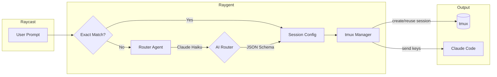
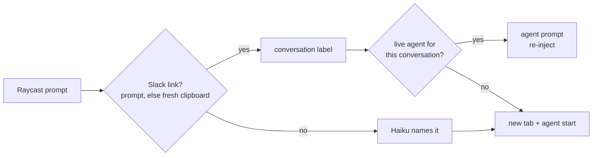

# Raygent

Raycast → Claude Code in Herdr (or tmux). Launch Claude Code sessions with AI-powered naming and workspace routing, and keep one session per Slack conversation.

## Architecture


```mermaid
flowchart LR
    subgraph Raycast
        R[User Prompt]
    end

    subgraph Raygent
        R --> EM{Exact Match?}
        EM -->|Yes| SC[Session Config]
        EM -->|No| RA[Router Agent]
        RA -->|Claude Haiku| AI{AI Router}
        AI -->|JSON Schema| SC
        SC --> TM[tmux Manager]
    end

    subgraph Output
        TM -->|create/reuse session| TMUX[(tmux)]
        TM -->|send keys| CC[Claude Code]
    end
```

## Flow

1. **Raycast** triggers with user prompt
2. **Exact Match** checks `exactKeywords` for deterministic routing (skips AI)
3. **Router Agent** (fallback) calls Claude Haiku with `--json-schema` for structured output
4. **AI** determines session name + workspace from `config.json` keywords
5. **tmux** creates session or adds pane to existing session (if `tmuxSession` set)
6. **Claude Code** launches with original prompt (headless)

## Setup

```bash
# Install
cp config.example.json config.json
# Edit config.json with your paths and keywords

# Add to Raycast
# Import raycast-raygent.sh as Script Command
```

## Configuration

`config.json` (gitignored):

```json
{
  "default": "work",
  "workspaces": {
    "work": {
      "path": "/path/to/work",
      "keywords": ["work", "project"]
    },
    "personal": {
      "path": "/path/to/personal",
      "keywords": ["personal", "dotfiles"]
    },
    "review": {
      "path": "/path/to/work",
      "keywords": ["review", "pr"],
      "exactKeywords": ["review-pr", "pr-review"],
      "tmuxSession": "review"
    }
  }
}
```

### Workspace Options

| Option          | Type     | Description                                       |
| --------------- | -------- | ------------------------------------------------- |
| `path`          | string   | Working directory for the session                 |
| `keywords`      | string[] | Keywords for AI router matching                   |
| `exactKeywords` | string[] | Deterministic matching (bypasses AI router)       |
| `tmuxSession`   | string   | Fixed session name; reuses session with new panes |

### Launch and Slack options (per machine)

```json
{
  "launch": { "mux": "herdr", "fixedCwd": "~/work", "focusOnLaunch": false },
  "slack": {
    "workspaces": {
      "acme.slack.com": {
        "mcpServer": "slack-acme",
        "teamId": "T0123ABCD",
        "authCommand": "cat ~/.config/raygent/acme-slack-headers.json"
      }
    }
  }
}
```

| Option                  | Description                                                                      |
| ----------------------- | -------------------------------------------------------------------------------- |
| `launch.mux`            | `herdr` or `tmux` (default) for Raycast prompts                                  |
| `launch.fixedCwd`       | Always start Raycast prompts here; skips routing (scheduled runs still route)    |
| `launch.focusOnLaunch`  | Focus the agent and bring Ghostty forward                                        |
| `slack.workspaces.*`    | Keyed by workspace host                                                          |
| `mcpServer`             | Slack MCP server the session should read the conversation with                  |
| `teamId`                | Matches `app.slack.com` / `slack://` links, which carry no host                  |
| `authCommand`           | Prints a JSON object of HTTP headers for Slack Web API calls, e.g. `{"Authorization": "Bearer …"}` (optional) |

### Path expansion

`path` supports `~`, `$VAR`, and `${VAR}` so configs stay portable across machines
instead of hardcoding absolutes (e.g. `"$WORK_DIR"`, `"~/vault"`,
`"$WORK_DIR/repos"`). Variables resolve from the **process environment at
launch time** — an undefined variable throws loudly rather than silently starting a
session in the wrong directory. Callers spawned outside an interactive shell (e.g.
launchd) must export the referenced vars themselves before invoking raygent.

## Usage

### Via Raycast

Invoke Raygent script command with your prompt.

### CLI

```bash
bun ~/dotfiles/scripts/raygent/raygent.ts "your prompt here"
```

### Test Router

```bash
bun ~/dotfiles/scripts/raygent/lib/router-agent.ts "your prompt"
```

### Attach to Session

```bash
tmux attach -t <session-name>
```

### Herdr launches

With `launch.mux: "herdr"` a Raycast prompt starts Claude as a **named Herdr agent** in its own tab of a Herdr workspace (created on first use): `slack` when the prompt has Slack context, `raycast` otherwise, then submits the prompt with `herdr agent prompt`. The agent name doubles as the Claude session name (`claude -n`). A macOS notification says where the prompt went. If Herdr is unavailable the launch falls back to tmux.


```mermaid
flowchart LR
    P[Raycast prompt] --> S{Slack link?<br/>prompt, else fresh clipboard}
    S -->|yes| L[conversation label]
    S -->|no| H[Haiku names it]
    L --> M{live agent for<br/>this conversation?}
    M -->|yes| R[agent prompt<br/>re-inject]
    M -->|no| N[new tab + agent start]
    H --> N
```

### Slack conversations

A Slack message link in the prompt, or a link copied since the last launch (the clipboard must hold exactly the link), binds the launch to that conversation:

- **Key**: workspace host + channel id, so any message link from the same channel reaches the same session.
- **Re-inject**: if a live agent is bound to the key (pane token `slack_key`), the prompt goes to it instead of a new session. If it is waiting on a permission prompt, raygent waits up to 10 minutes, then delivers; otherwise the prompt is saved under `$RAYGENT_STATE_DIR/pending/`.
- **Name**: the channel name (`dm-…` / `gdm-…` for direct messages), looked up with the workspace's `authCommand` and cached for a week; without one the session is named `slack-{channelid}`.
- **Context**: the prompt is prefixed with the link and the Slack MCP server to read it with.
- `!noclip` at the start of a prompt skips the clipboard. Scheduled runs never read it.

### Scheduled runs

Prompts containing agent-scheduler's `<agent-scheduler task-id="…" />` marker are scheduled runs. They launch claude with a pre-provisioned `--session-id` and are recorded for agent-scheduler's stale-session reaper: tmux sessions get `@sched_task` / `@sched_claude_session` / `@sched_launched` options; Herdr runs go in `~/.local/state/raygent/herdr-runs.json` (Herdr pane metadata doesn't survive a server restart; tab ids and labels do).

With `AGENT_SCHEDULER_MUX=herdr` a scheduled run opens as a tab (`{task} MM-DD HH:mm`) in the `schedules` workspace of the default Herdr session, starting a headless server if none is running; it falls back to tmux when `herdr` is missing or fails. Overrides: `RAYGENT_HERDR_SESSION` (named session), `RAYGENT_HERDR_WORKSPACE` (workspace label), `RAYGENT_STATE_DIR` (registry dir).

## Files

| File                  | Purpose                       |
| --------------------- | ----------------------------- |
| `raygent.ts`          | Main orchestrator             |
| `lib/router-agent.ts` | AI routing via Claude Haiku   |
| `lib/tmux.ts`         | tmux session management       |
| `lib/herdr.ts`        | Herdr CLI, tabs, run registry |
| `lib/herdr-agent.ts`  | Named agents, re-inject       |
| `lib/slack-link.ts`   | Slack link parsing, clipboard pick |
| `lib/slack.ts`        | Conversation labels           |
| `lib/launch.ts`       | Per-machine launch settings   |
| `raycast-raygent.sh`  | Raycast script command        |
| `config.json`         | Workspace config (gitignored) |

## Dependencies

- [Bun](https://bun.sh) runtime
- [Claude CLI](https://github.com/anthropics/claude-code) (`~/.local/bin/claude`)
- [Herdr](https://herdr.dev) 0.9+ (optional; tmux otherwise)
- tmux
