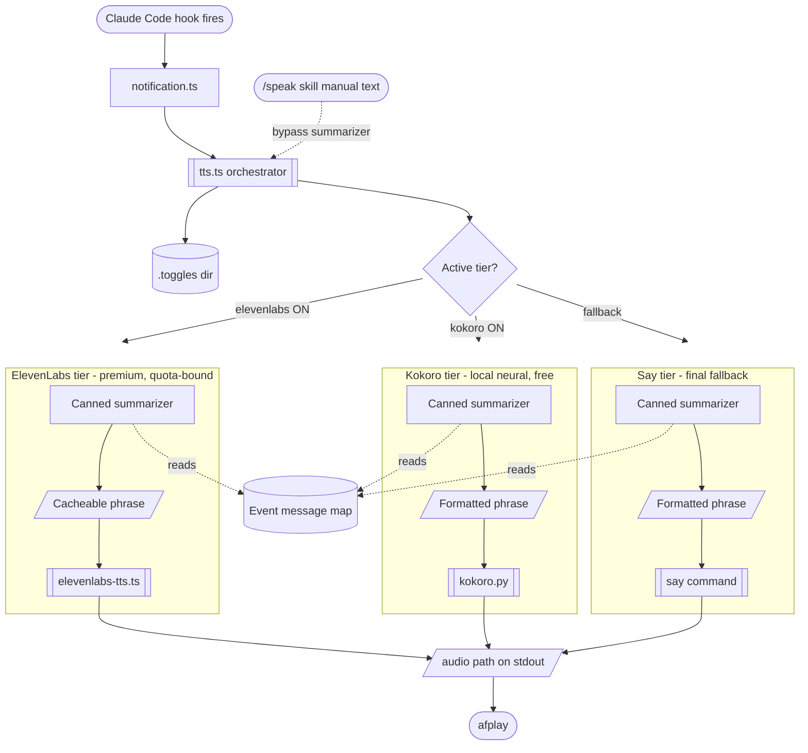

# tts — pluggable TTS cascade for Claude Code notifications

Three-tier cascade with per-tier summarizer mapping. Used by:

- `~/.claude/skills/speak/speak.sh` (manual `/speak <text>` invocation)
- `~/.claude/hooks/utils/notification.ts` (auto-fires on Claude Code `Notification` hook only — `Stop`/`SubagentStop` produce visual notif but stay silent)

## Architecture



## Setup

```bash
~/dotfiles/scripts/tts/setup.sh
```

Installs `uv` if missing, downloads Kokoro ONNX models (~350 MB) to `~/.cache/kokoro/`, touches `~/.claude/.toggles/kokoro` (default ON).

## Toggles

File-presence convention at `~/.claude/.toggles/<name>`:

| File         | Tier                           | Default            |
| ------------ | ------------------------------ | ------------------ |
| `elevenlabs` | ElevenLabs (paid, quota-bound) | OFF — opt-in       |
| `kokoro`     | Kokoro local neural            | **ON** after setup |

`say` is always available as final fallback.

```bash
touch ~/.claude/.toggles/elevenlabs       # enable
trash ~/.claude/.toggles/elevenlabs       # disable
```

## Usage

### Manual (explicit text)

```bash
~/dotfiles/scripts/tts/tts.ts "your message"
# prints audio path on stdout; pipe to afplay or use via speak.sh
```

### Hook mode (canned-summarizer formatting from a JSON ctx)

```bash
echo '{"hook_event_name":"Notification","sessionName":"src","windowName":"main","message":"Claude is waiting for your input"}' \
  | ~/dotfiles/scripts/tts/tts.ts --hook-mode
```

In hook mode the canned summarizer renders the message in the format `<session>-<window> - <msg>` (lowercased session, tight `session-window`, spaced before message).

Note: `notification.ts` currently builds this exact string itself and calls the orchestrator in **manual mode** with the prebuilt text. Hook mode remains available for any other caller that wants the summarizer to handle formatting.

Examples:

- Notification w/ `message: "Claude is waiting for your input"` → `breville-claude - Claude is waiting for your input`
- Notification w/ no message → `breville-claude - ready` (canned phrase by event)

## Configuration

Edit `~/dotfiles/scripts/tts/config.json`:

```json
{
  "cascade": ["elevenlabs", "kokoro", "say-default"],
  "providers": {
    "elevenlabs": { "summarizer": "canned" },
    "kokoro": { "summarizer": "canned" },
    "say-default": { "summarizer": "canned" }
  }
}
```

All tiers use the canned summarizer. No headless LLM invocation. If you want LLM-generated summaries later, drop a new summarizer file in `summarizers/` that hits the Anthropic API directly (do NOT spawn `claude -p` — it fires Stop hooks recursively).

## Tests

```bash
cd ~/dotfiles/scripts/tts && bun test
```

## Adding a new provider

1. Drop a file in `providers/<name>.ts` or `providers/<name>.py`
2. Contract: read text from argv or stdin, write audio file, print path on last line of stdout, exit non-zero on failure
3. Add an entry to `config.json` under `providers` with a `togglePath` and `summarizer` choice
4. Add it to `cascade` array at the position you want

## Adding a new summarizer

1. Drop a file in `summarizers/<name>.ts`
2. Contract: read JSON ctx from stdin (`{hookEvent, sessionName, transcriptPath}`), print summary text on stdout
3. Add an entry to `config.json` under `summarizers`
4. Reference by name in any provider's `summarizer` field

## Troubleshooting

- **Kokoro silent / falls through to say**: check `~/.cache/kokoro/kokoro-v1.0.onnx` exists (`ls -la ~/.cache/kokoro/`); re-run `setup.sh`
- **ElevenLabs API error**: check `~/dotfiles/scripts/elevenlabs/config.json` API key valid
- **Audio doesn't play**: orchestrator only generates the file; caller (`speak.sh`, `notification.ts`) plays it via `afplay`
- **No tmux session/window in spoken text**: hook subprocess needs `TMUX` env from the parent. Launch Claude Code inside a tmux pane so the env propagates.
