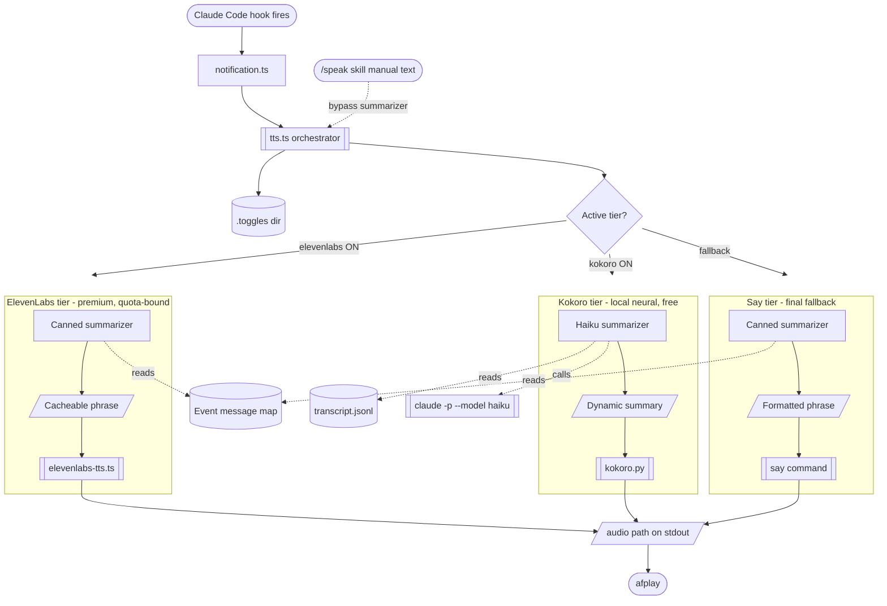

# tts — pluggable TTS cascade for Claude Code notifications

Three-tier cascade with per-tier summarizer mapping. Used by:

- `~/.claude/skills/speak/speak.sh` (manual `/speak <text>` invocation)
- `~/.claude/hooks/utils/notification.ts` — auto-fires on:
  - `Notification` → hook-mode → kokoro tier → haiku summarizer (dynamic transcript summary)
  - `Stop` → manual mode with prebuilt canned phrase `<session>-<window> - Finished`
  - `SubagentStop` and other events → visual only, no TTS

## Architecture



## Setup

```bash
~/dotfiles/scripts/tts/setup.sh
```

Installs `uv` if missing, downloads Kokoro ONNX models (~350 MB) to `~/.cache/kokoro/`, touches `~/.claude/.toggles/kokoro` (default ON).

## Toggles

File-presence convention at `~/.claude/.toggles/<name>`:

| File         | Tier                           | Default            |
| ------------ | ------------------------------ | ------------------ |
| `elevenlabs` | ElevenLabs (paid, quota-bound) | OFF — opt-in       |
| `kokoro`     | Kokoro local neural            | **ON** after setup |

`say` is always available as final fallback.

```bash
touch ~/.claude/.toggles/elevenlabs       # enable
trash ~/.claude/.toggles/elevenlabs       # disable
```

## Usage

### Manual (explicit text)

```bash
~/dotfiles/scripts/tts/tts.ts "your message"
# prints audio path on stdout; pipe to afplay or use via speak.sh
```

### Hook mode (per-tier summarizer-driven)

`~/.claude/hooks/utils/notification.ts` invokes this path on `Notification` events:

```bash
echo '{"hook_event_name":"Notification","sessionName":"src","windowName":"main","transcript_path":"/path/to/transcript.jsonl","message":"Claude is waiting for your input"}' \
  | ~/dotfiles/scripts/tts/tts.ts --hook-mode
```

The orchestrator walks the cascade, picks the first tier with its toggle ON, and runs that tier's summarizer:

- **kokoro tier (default ON)** → `haiku` summarizer reads `transcript_path`, calls `claude -p --model haiku`, emits `<session>-<window> - <one-or-two-sentence dynamic summary>`.
- **elevenlabs / say-default tiers** → `canned` summarizer emits `<session>-<window> - <event-phrase>` (or the raw message text if injected).

Examples:

- Kokoro w/ live transcript → `breville-memory - Build passed. Two snapshot tests updated.` (haiku-generated)
- Say fallback → `breville-memory - ready` (canned phrase by event)
- Notification w/ raw message + canned tier → `breville-memory - Claude is waiting for your input`

## Configuration

Edit `~/dotfiles/scripts/tts/config.json`:

```json
{
  "cascade": ["elevenlabs", "kokoro", "say-default"],
  "providers": {
    "elevenlabs": { "summarizer": "canned" },
    "kokoro": { "summarizer": "haiku" },
    "say-default": { "summarizer": "canned" }
  }
}
```

- **elevenlabs / say-default** → `canned` summarizer renders `<session>-<window> - <event-phrase>` (or raw message text if one was injected). Quota-safe, no LLM calls.
- **kokoro** → `haiku` summarizer invokes `claude -p --model haiku` with `disableAllHooks=true` from `cwd=/tmp`. It reads the last assistant turn from `transcript_path` and produces `<session>-<window> - <one-or-two-sentence summary>`. Falls back to `canned` on timeout / empty / error.

Recursion safety: `haiku.ts` passes `--settings '{"disableAllHooks":true}'` so the spawned `claude -p` subprocess does not re-fire Stop/Notification hooks.

## Tests

```bash
cd ~/dotfiles/scripts/tts && bun test
```

## Adding a new provider

1. Drop a file in `providers/<name>.ts` or `providers/<name>.py`
2. Contract: read text from argv or stdin, write audio file, print path on last line of stdout, exit non-zero on failure
3. Add an entry to `config.json` under `providers` with a `togglePath` and `summarizer` choice
4. Add it to `cascade` array at the position you want

## Adding a new summarizer

1. Drop a file in `summarizers/<name>.ts`
2. Contract: read JSON ctx from stdin (`{hookEvent, sessionName, transcriptPath}`), print summary text on stdout
3. Add an entry to `config.json` under `summarizers`
4. Reference by name in any provider's `summarizer` field

## Troubleshooting

- **Kokoro silent / falls through to say**: check `~/.cache/kokoro/kokoro-v1.0.onnx` exists (`ls -la ~/.cache/kokoro/`); re-run `setup.sh`
- **ElevenLabs API error**: check `~/dotfiles/scripts/elevenlabs/config.json` API key valid
- **Audio doesn't play**: orchestrator only generates the file; caller (`speak.sh`, `notification.ts`) plays it via `afplay`
- **No tmux session/window in spoken text**: hook subprocess needs `TMUX` env from the parent. Launch Claude Code inside a tmux pane so the env propagates.
